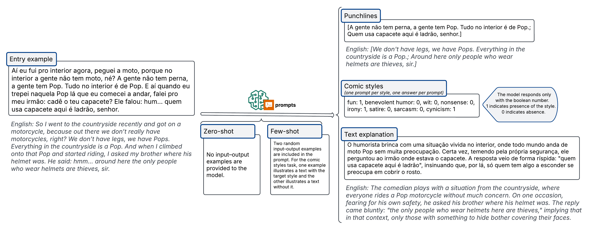

# HuNeBR - Brazilian Northeast Humor Benchmark

HuNeBR is a benchmark to evaluate LLMs regarding the understanding of humor in texts by comedians from Northeastern Brazil.



The HuNeBR benchmark includes three tasks and two prompting scenarios (zero-shot and few-shot). In the zero-shot setup, no examples are provided; in the few-shot setup, two examples are added to the prompt using a fixed seed. For comic style classification, one positive and one negative example are provided per style.

1. <b>Punchline Identification.</b>
The model receives the full humorous text and must return only the punchline segments — the parts that resolve an incongruity and trigger the comic effect — formatted as a structured list without extra commentary.

2. <b>Comic Style Classification.</b>
Based on eight styles (fun, benevolent humor, nonsense, wit, irony, sarcasm, satire, and cynicism), the model is asked whether a specific style is present in the text.
The output is binary: 1 (present) or 0 (absent). Multiple styles may co-occur in a single text.

3. <b>Humor Reasoning (Explanation).</b>
The model must provide a concise explanation of why the text is humorous, identifying the elements that produce the comic effect.
This task assesses the model’s ability to interpret and articulate humor mechanisms rather than merely recognize them.

Below are the instructions for installing the benchmark dependencies, running the predictions and evaluation, unfolding tasks and scenarios.

# Requirements

- Git (https://git-scm.com/downloads)
- Git LFS (https://git-lfs.com/)
- Python 3.10 or higher (https://www.python.org/downloads/)
- pip (https://pip.pypa.io/en/stable/installation/)

With the repository cloned and pip installed, run the command in the terminal:
```sh
pip install -r requirements.txt
```
This will install the benchmark dependencies.

# Running the benchmark

The benchmark offers three main tasks: punchline identification, comic style classification, and humorous text explanation.
Next, we'll walk you through how to configure the models and run the predictions and evaluation.

## Models config

A template file for configuring the models you want to run in the benchmark is at ```config/models_config.yaml```.

The template contains the models we ran in an initial experiment, with the credential fields to be filled in. They are: ``deepseek-r1-0528-qwen3-8b, gemini-2.5-flash, gemma-3-gaia-pt-br-4b-it, gpt-4, granite-3-3-8b-instruct, llama-3-405b-instruct and sabia-3.1.``

Example:

```
models:
  - provider: openai
    model_name: gpt-4
    api_key: 'YOUR_OPENAI_API_KEY'
```

Specifically, the stage of evaluating the task of explaining humorous texts involves a judgment model. This can be configured in the file ```config/judge_model_config.yaml```.

## Supported LLM Platforms

This project provides a unified interface for multiple Large Language Model (LLM) providers, allowing flexible integration across various APIs and infrastructures.
The following LLM platforms are currently supported:

1. OpenAI / MaritacaAI
- Key Configs: api_key, model_name, base_url
- Default Base URL: https://api.openai.com/v1
- Supports both OpenAI models (e.g., gpt-4, gpt-4o-mini) and compatible APIs such as <b>MaritacaAI</b>.

2. Hugging Face Hub
- Key Configs: model_name, task, token, device (device="cpu" → runs the model on the CPU (slower, but universal); device=0 → runs the model on GPU 0;device=1 → runs the model on GPU 1, and so on)
- Enables loading of transformer-based models from the Hugging Face Hub, with support for multiple tasks (e.g., text generation, classification).

3. Google Gemini
- Key Configs: api_key, model_name
- Integrates with Google’s Gemini API (PaLM successor), supporting text reasoning and multimodal capabilities.

4. Anthropic Claude
- Key Configs: api_key, model_name
- Provides access to Claude models (e.g., Claude 3 family) through the Anthropic API.

5. IBM Cloud Watsonx.ai
- Key Configs: model_id, api_key, service_url, project_id
- Connects to IBM’s Watsonx.ai platform for enterprise-grade LLMs and foundation models.

## Tasks and scenarios

Run the benchmark using the ```main.py``` script. By default, it executes all scenarios, all tasks, and evaluation.
It’s important to note that all results are persisted. Thus, if there was a previous execution, the next one will continue exactly from where it stopped.
Below are some examples of how the benchmark can be run via the command line, customizing tasks and scenarios.

Run everything (default)
```sh
python main.py
```

Run everything without evaluation
```sh
python main.py --evaluation false
```

Run only one scenario
```sh
python main.py --scenario zero-shot
```
Run multiple scenarios

```sh
python main.py --scenario zero-shot few-shot
```
Run only one task

```sh
python main.py --tasks punchlines
```
Run multiple tasks

```sh
python main.py --tasks punchlines comic_styles texts_explanation
```
Run specific scenario and tasks together

```sh
python main.py --scenario few-shot --tasks punchlines texts_explanation
```


# Evaluation metrics

Each model evaluation output includes task-specific metrics as described below:

<b>Punchlines</b>
  - dice_similarity – Measures the lexical overlap between model-predicted and human-annotated punchline segments using the Dice Similarity Coefficient (0 = no overlap, 1 = perfect match).

  - hit_rate_pre_treatment – Proportion of texts with at least one correctly identified punchline before any normalization or filtering steps.

  - hit_rate – Proportion of texts with at least one correct punchline after post-processing or normalization.

<b>Comic Styles</b>

- f1_score – Per-class F1-score (harmonic mean of precision and recall) for each of the eight comic styles: fun, benevolent humor, nonsense, wit, irony, satire, sarcasm, and cynicism.

- precision – Per-class precision, i.e., the proportion of predicted positives that are correct.

- recall – Per-class recall, i.e., the proportion of actual positives correctly predicted.

- accuracy – Per-class accuracy, representing the fraction of correct predictions (both positive and negative) for each style.

- f1_macro – Macro-averaged F1-score across all styles, giving equal weight to each class regardless of frequency.

- f1_micro – Micro-averaged F1-score, aggregating predictions across all classes and weighting by class frequency.

- hit_rate_pre_treatment – Fraction of texts where at least one style was correctly detected before post-processing.

- hit_rate – Fraction of texts where at least one style was correctly detected after post-processing.

- omission_rate – Proportion of texts for which the model failed to output any classification.

<b>Texts Explanations</b>

- Mean agreement score (1–5 Likert scale) between model-generated and human-annotated humor explanations, rated by an external judge model.
Higher values indicate stronger conceptual alignment and fewer omissions or distortions.

# Saving results

At the end of each run, prediction results are saved as JSON files in folders specific to each model, scenario, and task. For example:
```sh
predictions/
├── few-shot
│   ├── deepseek-r1-0528-qwen3-8b
│   │   ├── comic_styles_predictions.json
│   │   ├── punchlines_predictions.json
│   │   └── texts_explanations_predictions.json
```

Model evaluation results are also saved in JSON format, but divided into three types: aggregated metrics for each task for each model; individual metrics for each model's response to prompts; and saving of the judge model's evaluation responses, to persist previously generated responses. For example:

```sh
evaluation/
├── few-shot
│   ├── aggregate_metrics.json
│   ├── individual_metrics.json
│   └── texts_explanations_evaluation_results.json
```

# Results exploration examples

Some notebooks with exploration of both aggregate and individual metrics are available in the ``results_exploration.ipynb`` and ``qualitative_exploration.ipynb`` files.

## License

- **Code:** [MIT License](./LICENSE)
- **Data:** [CC BY-NC 4.0](./LICENSE-DATA.txt)
